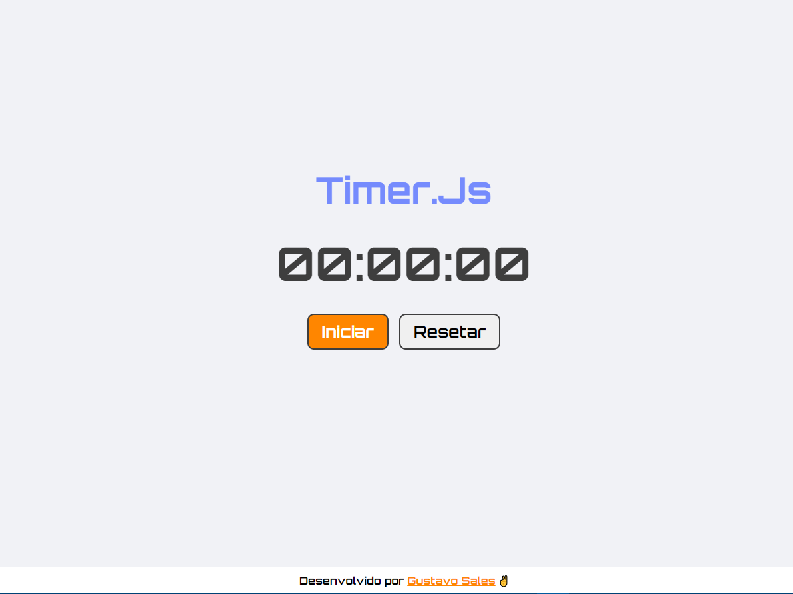

# Timer.js
 
Este é um projeto simples de um cronômetro desenvolvida usando HTML, CSS e JavaScript, utilizando o objeto Date.

## Acesse o projeto finalizado, online

### -> [Timer.Js](https://gustavo-sales.github.io/Timer.js/)
